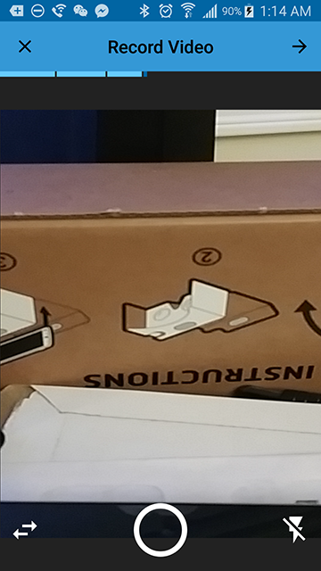
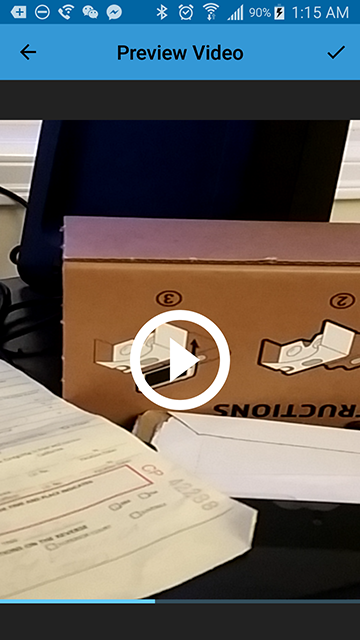
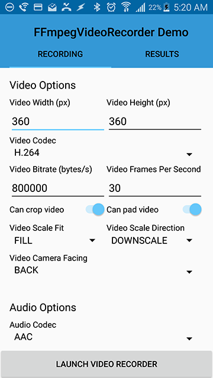
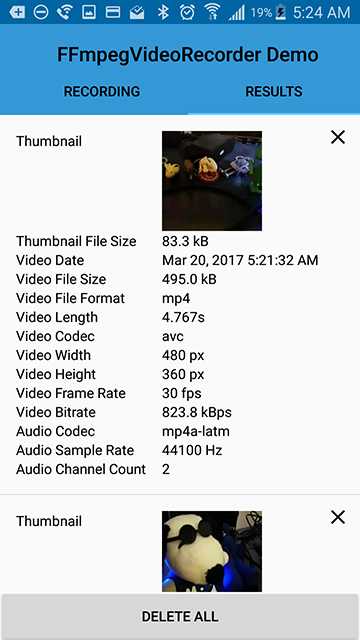

# FFmpegVideoRecorder - Customizable Video Recording Library for Android

The library provides a way to record audio and video separately and then merge them together using FFmpeg Recorder from JavaCV. It is designed to allow maximum customization of the video encoding and recording.

It has built in activities for easy recording and previewing. But it also exposes basic components that can be used to customize your own UI and logic.

## Features

### Recording primitives

- Able to record multiple clips and combine them into one video
- Can set the desired width and height dimensions
- Can set how the camera images are scaled and cropped to the desired width and height
- Can set attributes such as audio and video bitrate, codec, and quality
- Camera image is scaled for the desired aspect ratio
- Generates a thumbnail image for the video

### FFmpegRecorderActivity

Activity that allows the user to record videos in a way similar to instagram and snapchat

- Dynamically customize the color of the actionbar and widgets 
- Enable / disable flash
- Switch between front and back cameras
- Instagram / Snapchat like recording by holding down a button
- Can set the minimum and maximum recording time



### FFmpegPreviewActivity

Activity to preview the recorded video before selecting the video



## Limitations

- Video width must be a multiple of 2, so the recorded video might not be in the exact dimensions requested.

## Demo

There is a demo activity that allows you to try different settings for recording videos.





## Installation

[ ](https://bintray.com/amosyuen/maven/FFmpegVideoRecorder/_latestVersion)

### Gradle

```
compile 'com.amosyuen.ffmpegvideorecorder:ffmpeg-video-recorder:1.0.4'
```

### Maven

```
<dependency>
  <groupId>com.amosyuen.ffmpegvideorecorder</groupId>
  <artifactId>ffmpeg-video-recorder</artifactId>
  <version>1.0.4</version>
  <type>pom</type>
</dependency>
```

### Ivy

```
<dependency org='com.amosyuen.ffmpegvideorecorder' name='ffmpeg-video-recorder' rev='1.0.4'>
  <artifact name='$AID' ext='pom'></artifact>
</dependency>
```

### Local Checkout

```
git clone git://github.com/amosyuen/FFmpegVideoRecorder.git
```

## Usage

*For a working implementation, please have a look at the demo project*

1. For Android M and above, make sure you request the following permissions before starting the activity:

    - Manifest.permission.CAMERA
    - Manifest.permission.RECORD_AUDIO
    - Manifest.permission.WAKE_LOCK
    - Manifest.permission.WRITE_EXTERNAL_STORAGE

3. Send an intent to start the activity with the desired parameters. The parameters are required:

	```java
	private static final int RECORD_VIDEO_REQUEST = 1000;

	Intent intent = new Intent(this, FFmpegRecorderActivity.class);
	RecorderActivityParams params = new RecorderActivityParams.Builder(videoFile)
        .videoThumbnailOutput(thumbnailFile)
        .videoWidth(640)
        .videoHeight(480)
        .build();
    intent.putExtra(FFmpegRecorderActivity.RECORDER_ACTIVITY_PARAMS_KEY, params);
    startActivityForResult(intent, RECORD_VIDEO_REQUEST);
    ```

4. Override `onActivityResult` method and handle request code sent in step 3.

    ```java
    @Override
    public void onActivityResult(int requestCode, int resultCode, Intent data) {
        if (requestCode == RECORD_VIDEO_REQUEST) {
            switch (resultCode) {
                case RESULT_OK:
                    Uri videoUri = data.getData();
                    Uri thumbnailUri =
                            data.getParcelableExtra(FFmpegRecorderActivity.THUMBNAIL_URI_KEY);
                    break;
                case Activity.RESULT_CANCELED:
                    break;
                case FFmpegRecorderActivity.RESULT_ERROR:
                    Exception error = (Exception)
                            data.getSerializableExtra(FFmpegRecorderActivity.ERROR_PATH_KEY);
                    break;
            }
        }
    }
    ```

## Credits

This library is based off of these sources:

- https://github.com/sourab-sharma/TouchToRecord
- https://github.com/bytedeco/sample-projects/tree/master/JavaCV-android-example

It uses https://github.com/bytedeco/javacv for combining and encoding videos.

